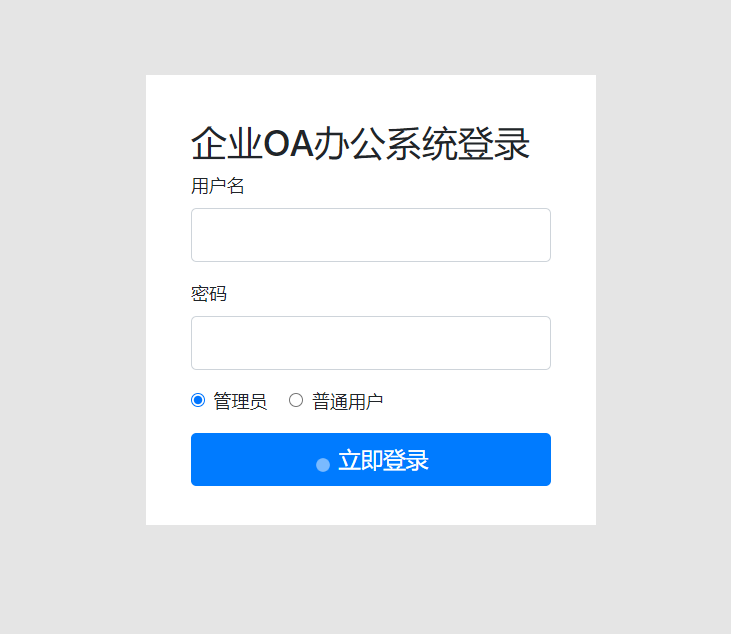
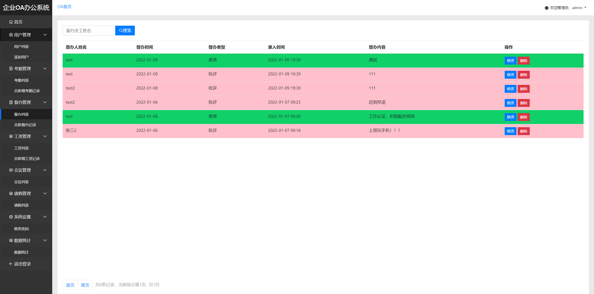
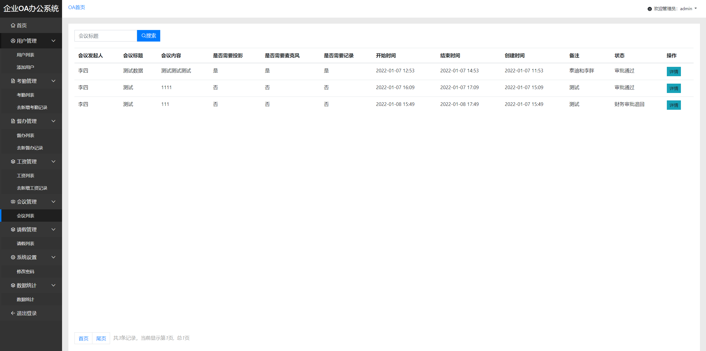
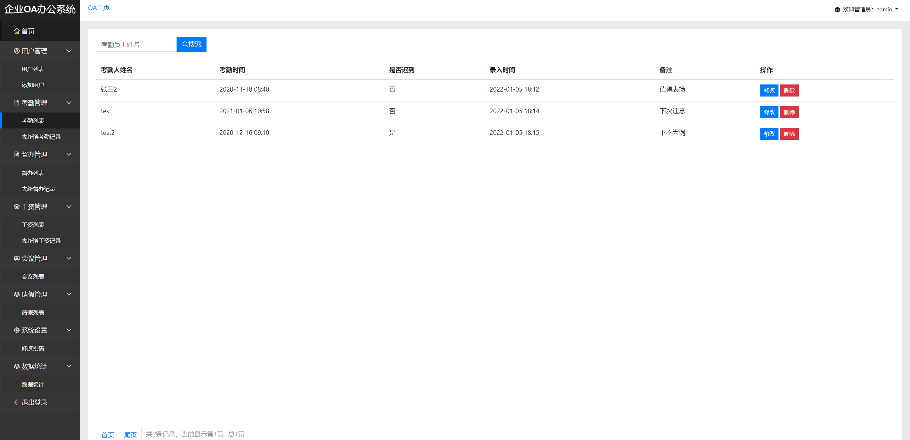
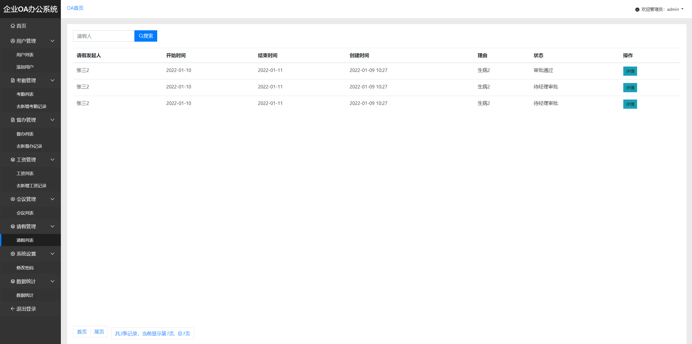
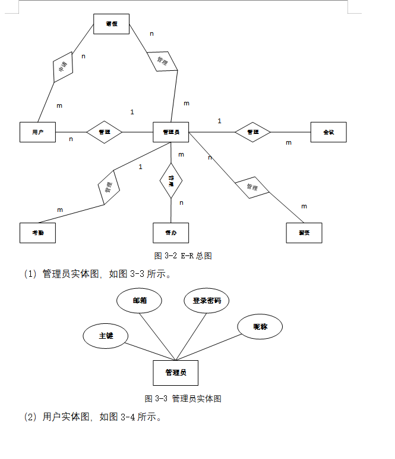
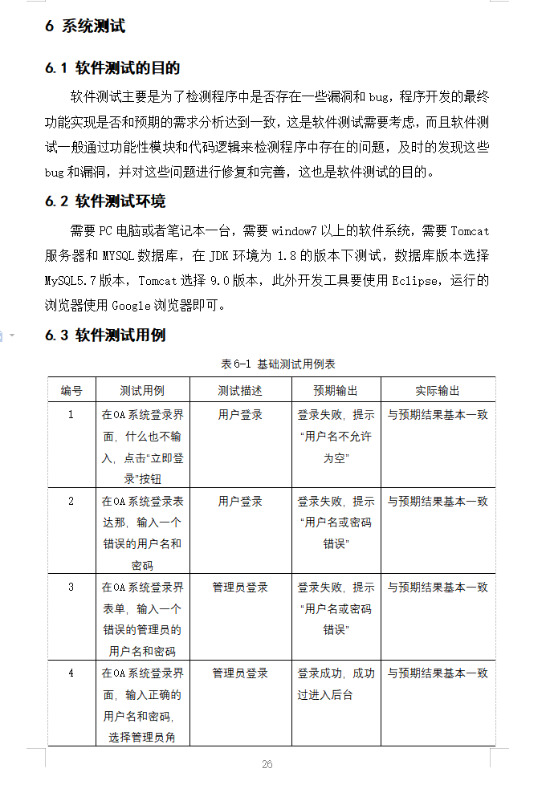

基于SSM的OA办公系统
=
### 完整代码获取地址：从戎源码网 ([https://armycodes.com/](https://armycodes.com/))
### 作者微信：19941326836  QQ：952045282 
### 承接计算机毕业设计、Java毕业设计、Python毕业设计、深度学习、机器学习
### 选题+开题报告+任务书+程序定制+安装调试+论文+答辩ppt 一条龙服务
### 所有选题地址https://github.com/nature924/allProject

一、项目介绍
---
基于SSM框架实现的OA办公系统包含四种角色：管理员、员工、部门经理、财务、老板,系统分为前台和后台两大模块，主要功能如下。

### 
【员工】：
1. 登录：员工可以使用自己的账号进行系统登录。
2. 查看督办：员工可以查看领导下达的任务和督办事项。
3. 查看公告：员工可以查看公司发布的公告和通知。
4. 考勤管理：员工可以进行考勤打卡和查看自己的考勤记录。
5. 薪资发放记录：员工可以查看自己的薪资发放记录。
6. 查看会议：员工可以查看公司组织的会议信息。
7. 请假：员工可以提交请假申请并查看请假审批状态。
8. 用章：员工可以提交用章申请并查看用章审批状态。
9. 个人信息管理：员工可以查看和修改自己的个人信息。
###
【部门经理】：
1. 登录：部门经理可以使用自己的账号进行系统登录。
2. 考勤管理：部门经理可以管理部门员工的考勤记录。
3. 会议管理：部门经理可以组织和管理部门的会议。
4. 接待管理：部门经理可以安排和管理部门的接待事宜。
5. 审批请假：部门经理可以对部门员工的请假申请进行审批。
6. 用章：部门经理可以审批部门员工的用章申请。
7. 员工督办：部门经理可以下达任务和督促员工完成。
8. 个人信息管理：部门经理可以查看和修改自己的个人信息。
###
【财务】：
1. 登录：财务可以使用自己的账号进行系统登录。
2. 薪资管理：财务可以管理薪资发放记录和进行薪资计算。
3. 查看公告：财务可以查看公司发布的公告和通知。
4. 用章：财务可以审批员工的用章申请。
5. 查看会议：财务可以查看公司组织的会议信息。
6. 请假审批：财务可以对员工的请假申请进行审批。
7. 接待审批：财务可以对员工的接待申请进行审批。
8. 个人信息管理：财务可以查看和修改自己的个人信息。
###

1. 登录：老板可以使用自己的账号进行系统登录。
2. 用户管理：老板可以管理系统中的用户，包括添加、编辑和删除用户信息。
3. 公告管理：老板可以发布和管理公司的公告和通知。
4. 会议管理：老板可以组织和管理公司的会议。
5. 用章管理：老板可以审批员工的用章申请。
6. 请假审批管理：老板可以对员工的请假申请进行审批。
7. 接待审批管理：老板可以对员工的接待申请进行审批。
8. 薪资审批管理：老板可以对薪资发放进行审批。
9. 个人信息管理：老板可以查看和修改自己的个人信息。
10. 统计：老板可以对公司的各项数据进行统计和分析。

二、项目技术
---
- 编程语言：Java
- 数据库：MySQL
- 项目管理工具：Maven
- 前端技术：JSP、HTML、Jquery、Layui、ECharts
- 后端技术：Spring、SpringMVC、MyBatis

三、运行环境
---
- 操作系统：Windows、macOS都可以
- JDK版本：JDK1.8以上都可以
- 开发工具：IDEA、Ecplise、Myecplise都可以
- 数据库: MySQL5.7以上都可以
- Tomcat：任意版本都可以
- Maven：任意版本都可以

四、运行截图
---

### 程序截图：

